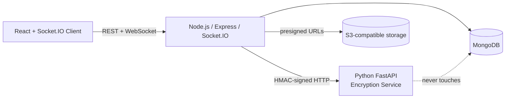
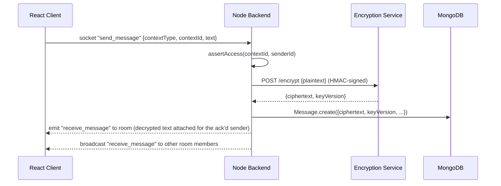
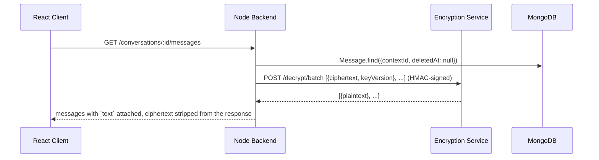

# Architecture

## Services

The encryption service is reachable only from Node over the internal Docker network — it is never exposed to the
internet and never talks to MongoDB directly. Node is the only client that ever calls it.

## Send-message data flow

Plaintext exists only in the request bodies between Client↔Node and Node↔Encryption-service, and briefly in
Node's process memory to build the socket payload. It is never written to disk anywhere except inside a client
device's own memory/UI. If the encryption service is unreachable, `encryptionClient.js` throws a 503 and the
message is never persisted — there is no plaintext fallback path.

## Read-message data flow

Only the participants/members already authorized for that conversation/boardroom can trigger a decrypt — access
is checked before the batch call, so the encryption service's decrypt endpoint is gated by Node's own
authorization layer rather than trusting the caller.

## Module map

Each mega-prompt module maps to one `node-backend/src/modules/<name>` folder (model + service + controller +
routes + validation, where applicable): `auth`, `users`, `conversations`, `messages`, `boardrooms`, `presence`,
`connections`, `files`, `notifications`, plus `activity` (added to power the member profile activity feed and
the online-sidebar aggregation, not present in the original mega-prompt). Cross-module calls only ever go through
a module's `*.service.js` — controllers and sockets never reach into another module's model directly, so the
authorization checks (`assertParticipant`, `assertMember`, `assertOwner`) can't be bypassed by a new call site.

## Encryption key management

Envelope encryption via HKDF-derived, versioned sub-keys of a single master KEK — see
`encryption-service/app/services/key_manager.py`. This avoids storing per-message DEKs at all: a message's
`keyVersion` field is enough to re-derive its exact key later. Rotating means bumping `ACTIVE_KEY_VERSION`; every
new message uses the new sub-key, every old message still decrypts because its version is still derivable from
the same KEK. The production upgrade (see `docs/SECURITY.md`) replaces the KEK env var with a real KMS secret and
optionally moves to randomly-generated, individually-wrapped DEKs for stronger key isolation per rotation epoch.

## Scaling path (not built in this pass — see the "Mongo/JWT only" decision)

Single Node instance today: Socket.IO rooms and the presence registry live in one process's memory. To run
multiple Node instances behind a load balancer: add `@socket.io/redis-adapter` (so `io.to(room).emit(...)` fans
out across instances) and move the presence `Map` in `presence.service.js` to Redis (hash of `userId → socketIds`,
shared across instances) plus `RefreshToken` lookups stay in Mongo as-is (already stateless-safe). MongoDB itself
should move to a replica set (or Atlas) for read scaling and failover once traffic approaches the 10k-concurrent
target.
